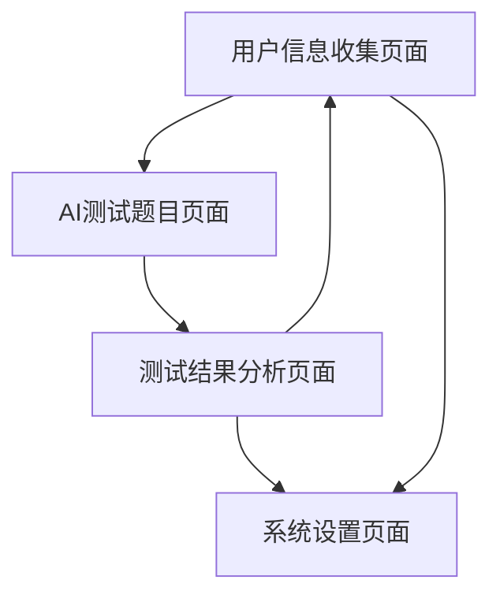

# 心理健康测试系统 - 产品需求文档

## 1. 产品概述

本产品是一个基于AI的心理健康测试系统，为用户提供个性化的心理健康评估服务。系统通过收集用户基本信息，利用AI生成定制化测试题目，并基于测试结果提供专业的心理健康分析报告。

产品旨在为用户提供便捷、专业的心理健康自评工具，帮助用户了解自身心理状态，及时发现潜在问题并获得专业建议。

## 2. 核心功能

### 2.1 用户角色

| 角色 | 注册方式 | 核心权限 |
|------|----------|----------|
| 普通用户 | 无需注册，直接使用 | 可填写信息、参与测试、查看结果 |

### 2.2 功能模块

我们的心理健康测试系统包含以下主要页面：
1. **用户信息收集页面**：基本信息表单、隐私说明、信息验证
2. **AI测试题目页面**：动态题目展示、答题进度、题目导航
3. **测试结果分析页面**：分析报告展示、建议推荐、结果分享
4. **系统设置页面**：隐私设置、数据管理、帮助说明

### 2.3 页面详情

| 页面名称 | 模块名称 | 功能描述 |
|----------|----------|----------|
| 用户信息收集页面 | 基本信息表单 | 收集年龄、性别、职业、教育背景、生活状况等基础信息 |
| 用户信息收集页面 | 隐私说明模块 | 展示数据使用说明、隐私保护政策、用户同意确认 |
| 用户信息收集页面 | 信息验证模块 | 验证必填字段完整性、数据格式校验、提交确认 |
| AI测试题目页面 | 题目展示模块 | 动态加载AI生成的个性化测试题目、支持多种题型 |
| AI测试题目页面 | 答题进度模块 | 显示当前进度、剩余题目数量、预计完成时间 |
| AI测试题目页面 | 题目导航模块 | 支持题目跳转、答案修改、暂存功能 |
| 测试结果分析页面 | 分析报告模块 | 展示AI生成的详细心理健康分析报告和评分 |
| 测试结果分析页面 | 建议推荐模块 | 提供个性化改善建议、专业资源推荐 |
| 测试结果分析页面 | 结果管理模块 | 支持结果保存、历史记录查看、数据导出 |
| 系统设置页面 | 隐私设置模块 | 管理数据使用权限、删除个人数据、匿名化选项 |
| 系统设置页面 | 帮助说明模块 | 使用指南、常见问题、联系方式 |

## 3. 核心流程

**用户测试流程：**
1. 用户进入系统，阅读隐私说明并同意使用条款
2. 填写个人基本信息表单（年龄、性别、职业、教育背景等）
3. 系统将用户信息发送给AI，请求生成个性化测试题目
4. AI根据用户信息生成定制化的心理健康测试题目
5. 用户逐题完成测试，系统实时保存答题进度
6. 测试完成后，系统将用户信息和测试答案发送给AI
7. AI基于综合数据生成详细的心理健康分析报告
8. 用户查看分析结果，获取个性化建议和专业推荐

## 4. 用户界面设计

### 4.1 设计风格

- **主色调**：温和的蓝色系（#4A90E2）和白色，营造专业可信的氛围
- **辅助色**：浅灰色（#F5F5F5）用于背景，绿色（#7ED321）用于积极反馈
- **按钮样式**：圆角矩形按钮，具有轻微阴影效果
- **字体**：系统默认字体，标题使用18-24px，正文使用14-16px
- **布局风格**：卡片式设计，顶部导航栏，内容区域居中对齐
- **图标风格**：简洁的线性图标，与整体设计保持一致

### 4.2 页面设计概览

| 页面名称 | 模块名称 | UI元素 |
|----------|----------|--------|
| 用户信息收集页面 | 基本信息表单 | 白色卡片背景，标签式输入框，蓝色主按钮，进度指示器 |
| AI测试题目页面 | 题目展示模块 | 大字号题目文本，选项按钮组，底部导航栏，进度条 |
| 测试结果分析页面 | 分析报告模块 | 分段式内容展示，图表可视化，色彩编码的评分系统 |
| 系统设置页面 | 设置选项 | 列表式布局，开关控件，分组标题，简洁的图标 |

### 4.3 响应式设计

产品采用移动端优先的响应式设计，支持手机、平板等不同屏幕尺寸。界面针对触摸操作进行优化，确保在各种设备上都能提供良好的用户体验。