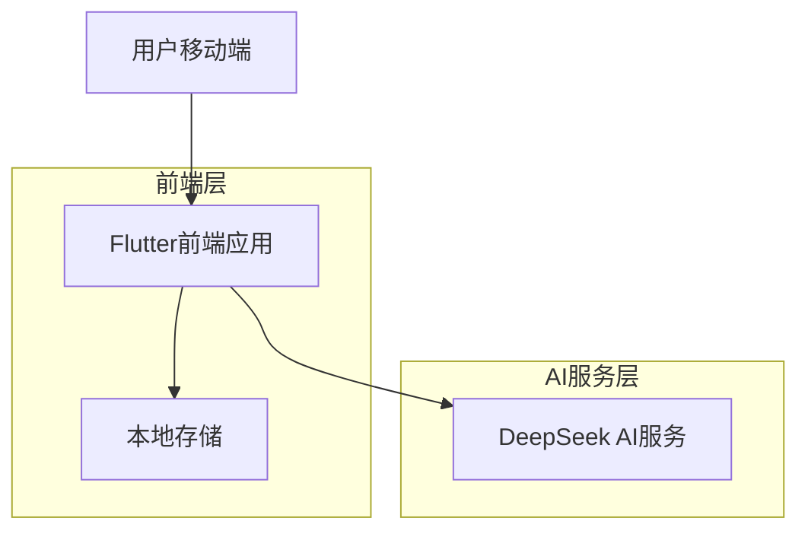
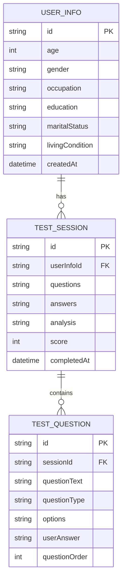

# 心理健康测试系统 - 技术架构文档

## 1. 架构设计



## 2. 技术描述

- **前端**: Flutter@3.x + Provider状态管理 + SharedPreferences本地存储
- **AI服务**: DeepSeek API（复用现有服务）
- **数据存储**: 本地存储（SharedPreferences + Hive）

## 3. 路由定义

| 路由 | 用途 |
|------|------|
| /psychological-test | 心理测试主页面，提供测试入口和说明 |
| /user-info-form | 用户信息收集表单页面 |
| /test-questions | AI生成的测试题目页面 |
| /test-results | 测试结果分析展示页面 |
| /test-history | 历史测试记录页面 |
| /test-settings | 测试相关设置页面 |

## 4. API定义

### 4.1 核心API

**用户信息提交与题目生成**
```
POST /chat/completions (DeepSeek API)
```

请求参数:
| 参数名称 | 参数类型 | 是否必需 | 描述 |
|----------|----------|----------|------|
| messages | Array | true | 包含系统提示和用户信息的消息数组 |
| model | string | true | 使用的AI模型名称 |
| stream | boolean | true | 是否使用流式响应 |
| max_tokens | number | true | 最大响应token数 |
| temperature | number | true | 响应随机性控制 |

响应:
| 参数名称 | 参数类型 | 描述 |
|----------|----------|------|
| choices | Array | AI生成的响应选择 |
| content | string | 生成的测试题目内容 |

请求示例:
```json
{
  "model": "deepseek-chat",
  "messages": [
    {
      "role": "system",
      "content": "你是专业的心理健康评估师..."
    },
    {
      "role": "user",
      "content": "用户信息：年龄25岁，职业程序员..."
    }
  ],
  "stream": true,
  "max_tokens": 2000,
  "temperature": 0.7
}
```

**测试结果分析**
```
POST /chat/completions (DeepSeek API)
```

请求参数:
| 参数名称 | 参数类型 | 是否必需 | 描述 |
|----------|----------|----------|------|
| messages | Array | true | 包含用户信息、测试题目和答案的消息数组 |
| model | string | true | 使用的AI模型名称 |
| stream | boolean | true | 是否使用流式响应 |

响应:
| 参数名称 | 参数类型 | 描述 |
|----------|----------|------|
| analysis | string | 心理健康分析报告 |
| recommendations | Array | 个性化建议列表 |

## 5. 数据模型

### 5.1 数据模型定义



### 5.2 本地数据存储结构

**用户信息模型 (UserInfo)**
```dart
class UserInfo {
  final String id;
  final int age;
  final String gender;
  final String occupation;
  final String education;
  final String maritalStatus;
  final String livingCondition;
  final DateTime createdAt;
}
```

**测试会话模型 (TestSession)**
```dart
class TestSession {
  final String id;
  final String userInfoId;
  final List<TestQuestion> questions;
  final Map<String, String> answers;
  final String? analysis;
  final int? score;
  final DateTime? completedAt;
}
```

**测试题目模型 (TestQuestion)**
```dart
class TestQuestion {
  final String id;
  final String questionText;
  final QuestionType type;
  final List<String>? options;
  final String? userAnswer;
  final int order;
}

enum QuestionType {
  singleChoice,
  multipleChoice,
  scale,
  text
}
```

**本地存储键值定义**
```dart
// SharedPreferences 键值
static const String USER_INFO_KEY = 'user_info';
static const String TEST_SESSIONS_KEY = 'test_sessions';
static const String CURRENT_SESSION_KEY = 'current_session';
static const String PRIVACY_CONSENT_KEY = 'privacy_consent';
static const String SETTINGS_KEY = 'app_settings';

// Hive Box 名称
static const String USER_INFO_BOX = 'user_info_box';
static const String TEST_SESSIONS_BOX = 'test_sessions_box';
static const String CACHE_BOX = 'cache_box';
```